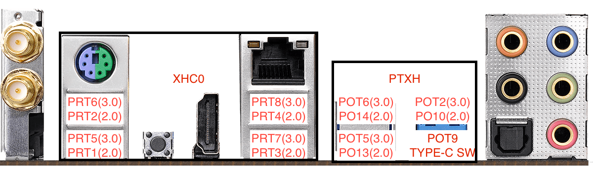
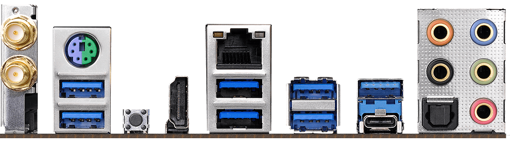

# x470-taichi-usb-map

## 大陆版X470太极 (X470 taichi China mainland version)：

## 备注(Note)：

Catalina 系统下，鼠标键盘（2.0）插在**XHC0**下无法休眠。

In Catalina, when USB 2.0 mouse and keyboard plug in XHC0, can't sleep.

建议直接插在PTXH下。

Recommended plug in to PTXH directly。

### 原图(Origin image)：

## 其它端口(Other port)：

我的主板上的其它端口：

My motherboard other port:

.png)
